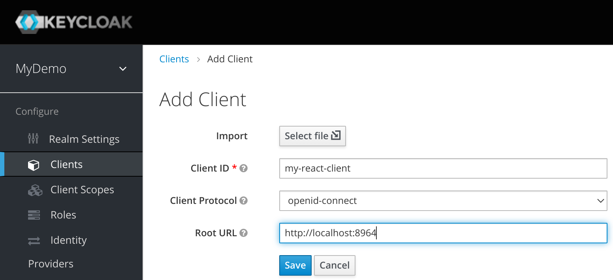

Keycloak with React demo
========================


### Reference

This demo is based on this tutorial:
https://scalac.io/blog/user-authentication-keycloak-1/

More references:
- [Keycloak Javascript Adapter Official Doc](https://www.keycloak.org/docs/latest/securing_apps/#_javascript_adapter)
- [Another More Realistic Keycloak React Quick Implementation Example](https://blog.logrocket.com/implement-keycloak-authentication-react/)
- [Passwordless Authentication With OTP](https://medium.com/profusion-engineering/keycloak-passwordless-authentication-550ca095c0bf)
- [Server Administration Guide](https://www.keycloak.org/docs/latest/server_admin/)
- [Starting Keycloak Docker Container](https://www.keycloak.org/getting-started/getting-started-docker)
- [Example on WordPress with Keycloak](https://plugins.miniorange.com/keycloak-single-sign-on-wordpress-sso-oauth-openid-connect)


### Start this demo
```
docker-compose up
```


### Access to demo

#### Management Panel
[Keycloak Admin Panel](http://localhost:8080/auth/admin/master/console/)

#### Normal User Pages
[Custom Page](http://localhost:8964)
[User Profile Page](http://localhost:8080/auth/realms/MyDemo/account/)

#### Local Email Management Page
[MailSlurper](http://127.0.0.1:8081)


### Basic Setup

#### Add Realm for Demo


#### Add Client for React Demo Logon Page


*Root URL*: ***http://localhost:8964***



#### Setup Local SMTP Server for New Client

*Host*: `mailslurper`
*Port*: `2500`
*From*: ***(any email address)***


### Products in this demo

- [Keycloak](https://www.keycloak.org)
- [React Demo Page](https://github.com/kmikulski/blog-keycloak/tree/master/keycloak-react-part1)
- [MailSlurper](https://www.mailslurper.com)